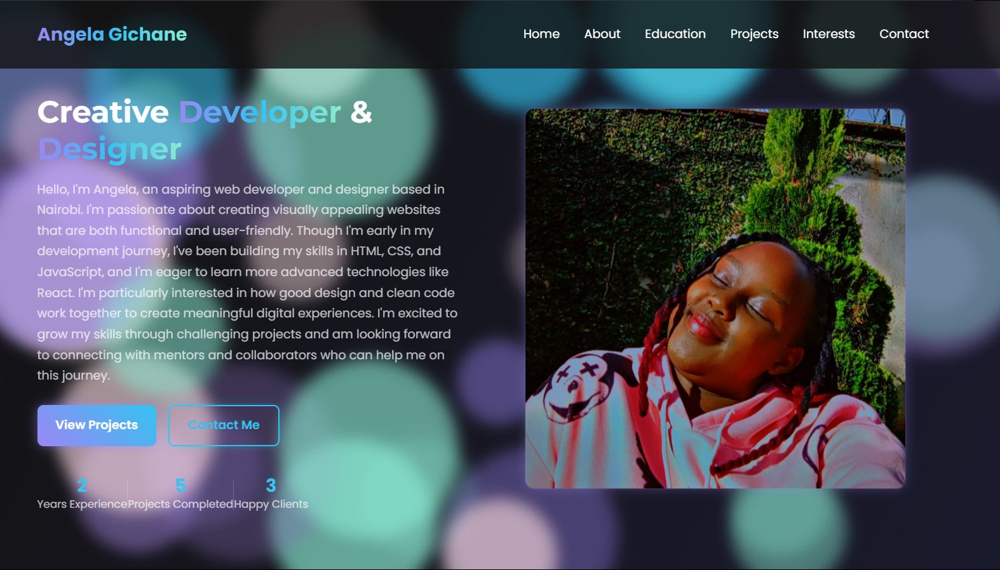

# Angela Gichane - Portfolio Website

A responsive personal portfolio website showcasing my development skills, projects, and professional journey. This website features modern design elements with interactive components and a sleek aurora-themed UI.



## 📋 Features

- **Responsive Design**: Fully responsive layout that works on mobile, tablet, and desktop devices
- **Interactive Aurora Background**: Dynamic canvas background effect with particle animation
- **Modern UI Components**: Clean, accessible interface with animated transitions
- **Contact Form**: Functional contact form with form validation
- **Project Showcase**: Gallery of my development and design projects
- **Skills Visualization**: Visual representation of technical skills and proficiency levels

## 🛠️ Technologies Used

- HTML5 & CSS3
- JavaScript (ES6+)
- Firebase (for contact form backend)
- CSS Animations and Transitions
- Responsive Layout Techniques
- Google Fonts
- Canvas API for background effects

## 🚀 Setup Instructions

1. Clone this repository:
   ```
   git clone https://github.com/AngieGichane/portfolio
   ```

2. Navigate to the project directory:
   ```
   cd portfolio-website
   ```

3. Open `index.html` in your browser to view locally

4. To deploy, upload all files to your web server or use a service like Netlify or GitHub Pages

## 🔧 Customization

This portfolio is designed to be easily customizable:

1. **Personal Information**: Update the personal details in index.html
2. **Projects**: Modify the project cards in the projects section
3. **Skills**: Adjust the skill percentages in the About section
4. **Colors**: The aurora theme colors can be modified in styles.css
5. **Images**: Replace placeholder images with your own photographs or designs

## 📱 Mobile Responsiveness

The website is optimized for various screen sizes:
- Mobile: 320px and up
- Tablet: 768px and up
- Desktop: 1024px and up

## 🔗 Live Demo

Visit the live portfolio site: [angela-gichane-portfolio.netlify.app](https://angela-gichane-portfolio.netlify.app)

## 📄 License

This project is currently unlicensed. A proper license will be added soon to clarify terms of use. Until then, all rights are reserved and the code is provided for viewing purposes only.

## 🙏 Acknowledgments

- Background animation inspired by [aurora-effect](https://github.com/example/aurora-effect)
- Icons from [Font Awesome](https://fontawesome.com)
- Inspiration from various developer portfolios on Dribbble and Behance

---

© 2025 Angela Gichane. All Rights Reserved.
